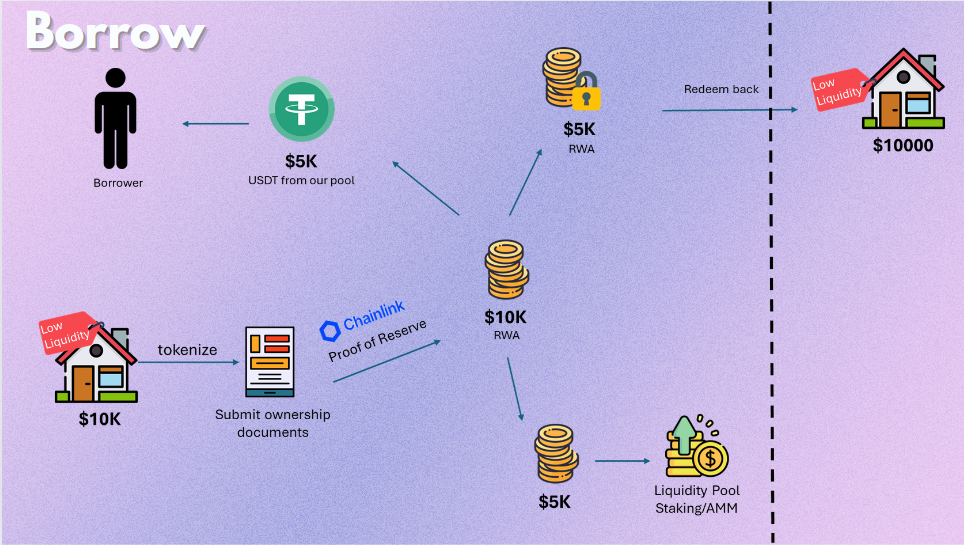
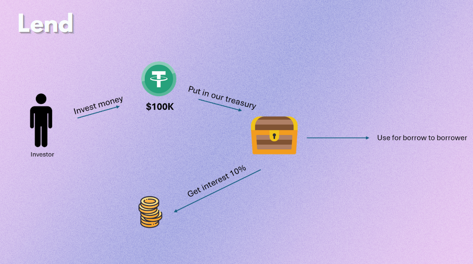

# RWAR
This project is aimed to make **lending process easier** and **more accessible** for everyone, by guaranteeing both **transparency** and **asset-token liquidity**.

## Problem Statements
40% potential borrowers face difficulties obtaining loans due to inability of financial institutions to properly assess or value non-traditonal assets.

## Solution
- RWA tokenization
- Liquidity pool

## Unique Selling Point
- Integration with Zk-ID Valuation for Offchain Data by Oracle Node
- Liquid Staking of Tokenized Assets by AMM and CLMM
- Cross Chain Transfer Protocol

## Business Sustainability
- 5% yield from liquidity pool staking
- 0.01% of transaction fee based on the transaction

## Future Enhancements
- Expand more types of 'hard-to-sell' assets avaialble to be used as collateral for lending purposes
- Regulatory and legal updates

## Conceptual Map
#### Borrow

#### Lend

## Resources Link
- [RWAR - Canva Presentation Link](https://discord.com/channels/1274265023996235838/1274265023996235841/1274619558577049671)
- [YouTube Presentation Link](https://youtu.be/Zwwj_TSZL_I)

## GitHub Folders
Frontend folder:
- [`/frontend`](https://github.com/WenHao1223/nickguhr/tree/main/frontend)

Backend folders:
- [Aptos - `/RWALending`](https://github.com/WenHao1223/nickguhr/tree/main/RWALending)
- [Solidity - `Rwa.sol`](https://github.com/WenHao1223/nickguhr/tree/main/Rwa.sol)